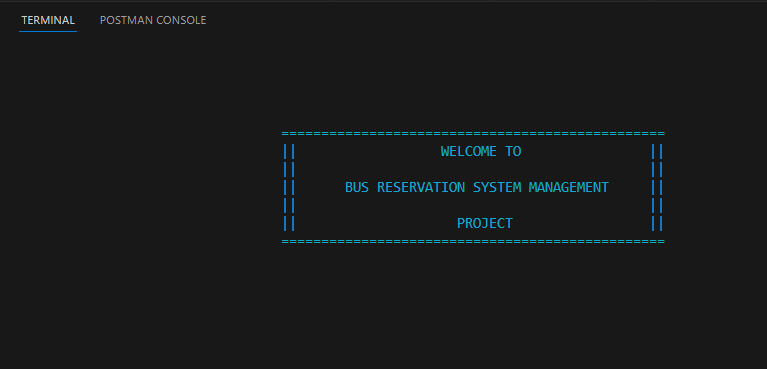
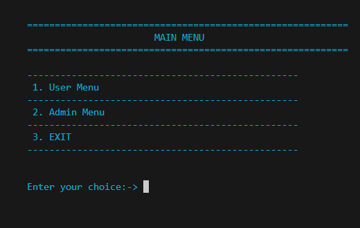
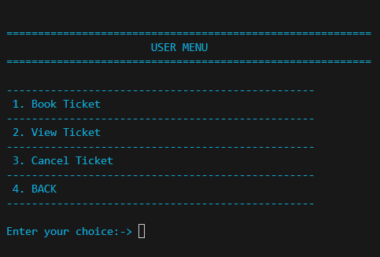
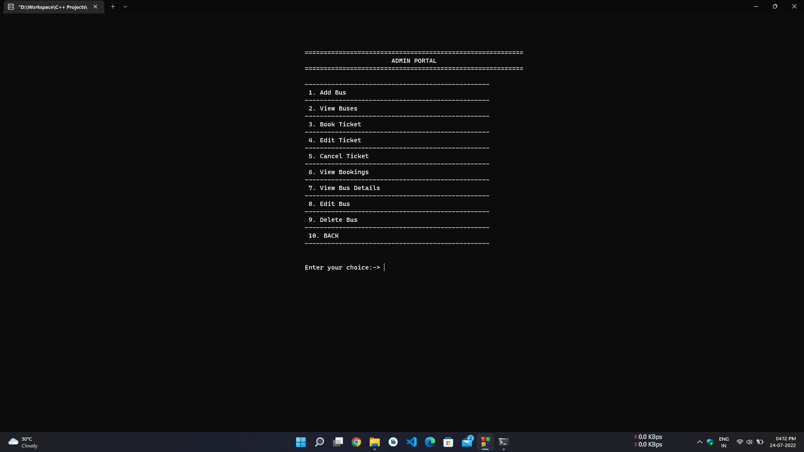

# Bus Reservation System Management with OOP and File Handling in C++

This repository contains the Bus Reservation System Management project developed using Object Oriented Programming (OOP) and File Handling concepts in C++.

## Table of Contents

- [Bus Reservation System Management with OOP and File Handling in C++](#bus-reservation-system-management-with-oop-and-file-handling-in-c)
  - [Table of Contents](#table-of-contents)
  - [Features](#features)
  - [Sceenshots](#sceenshots)
  - [Getting Started](#getting-started)
    - [Prerequisites](#prerequisites)
    - [Installation](#installation)
    - [Compilation](#compilation)
    - [Running the Application](#running-the-application)
    - [Admin Credentials](#admin-credentials)
  - [File Structure](#file-structure)
  - [Classes and Methods](#classes-and-methods)
    - [Bus Class](#bus-class)
    - [Reservation Class](#reservation-class)
    - [File Handling](#file-handling)
  - [How to Use](#how-to-use)


## Features

- **Bus Management**: Add, view, and remove bus details.
- **Reservation System**: Book, view, and cancel reservations.
- **File Handling**: Persist bus and reservation data using file handling techniques.
- **User Interface**: Command-line based user interface for interacting with the system.

## Sceenshots

- Welcome Screen



- Main Menu



- User Menu



- Admin Menu




## Getting Started

To get started with the development or usage of this project, follow the instructions below:

### Prerequisites

- A C++ compiler (such as g++, clang++)
- A suitable development environment (such as Visual Studio, Code::Blocks, or a text editor with command line tools)

### Installation

1. Clone this repository to your local machine:

    ```bash
    git clone https://github.com/Shivang-6/CPP_Project.git
    ```

2. Navigate into the cloned repository directory:

    ```bash
    cd CPP_Project
    ```

### Compilation

To compile the project, you can use the following command in the terminal:

```bash
g++ -o BusReservationSystem main.cpp Bus.cpp Reservation.cpp
```

This command assumes you have `main.cpp`, `Bus.cpp`, and `Reservation.cpp` files. Modify it according to your actual file names.

### Running the Application

After successfully compiling the project, you can run the application using the command:

```bash
./BusReservationSystem
```

### Admin Credentials

Username : `admin`
Password : `pass`

## File Structure

The project directory typically contains the following files:

- `main.cpp`: The main entry point of the application.
- `Bus.h` and `Bus.cpp`: Bus class definition and implementation.
- `Reservation.h` and `Reservation.cpp`: Reservation class definition and implementation.
- `data/`: A directory containing data files for buses and reservations.
- `utils.h`: A file contains required utility functions.

## Classes and Methods

### Bus Class

This class manages bus details and includes the following methods:

- `void addBus()`: Adds a new bus.
- `void displayBuses()`: Displays all buses.
- `void removeBus()`: Removes a bus by ID.

### Reservation Class

This class manages reservations and includes the following methods:

- `void bookTicket()`: Books a new ticket.
- `void viewReservations()`: Displays all reservations.
- `void cancelReservation()`: Cancels a reservation by ID.

### File Handling

Data persistence is achieved using file handling concepts. The bus and reservation data are stored in separate files within the `data/` directory.

## How to Use

1. **Add a Bus**: Select the option to add a bus and enter the required details.
2. **View Buses**: Select the option to view all available buses.
3. **Remove a Bus**: Select the option to remove a bus and provide the bus ID.
4. **Book a Ticket**: Select the option to book a ticket and enter the required details.
5. **View Reservations**: Select the option to view all reservations.
6. **Cancel a Reservation**: Select the option to cancel a reservation and provide the reservation ID.

